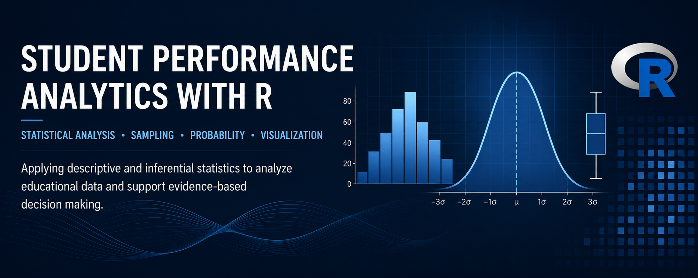
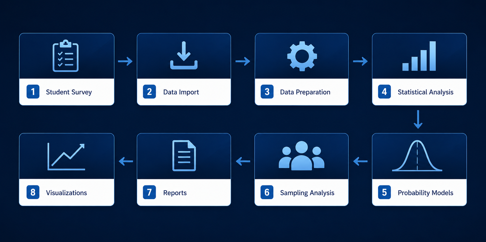
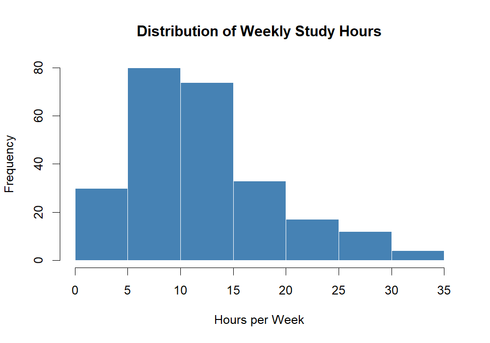
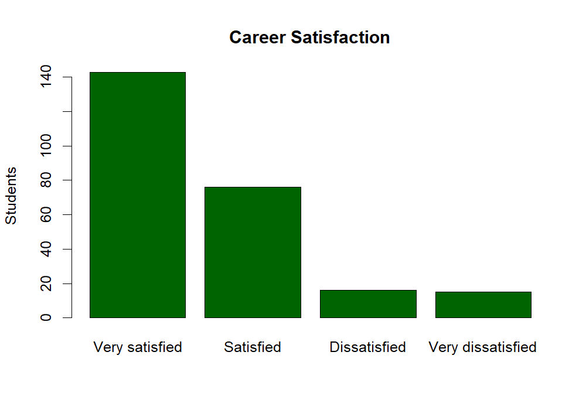
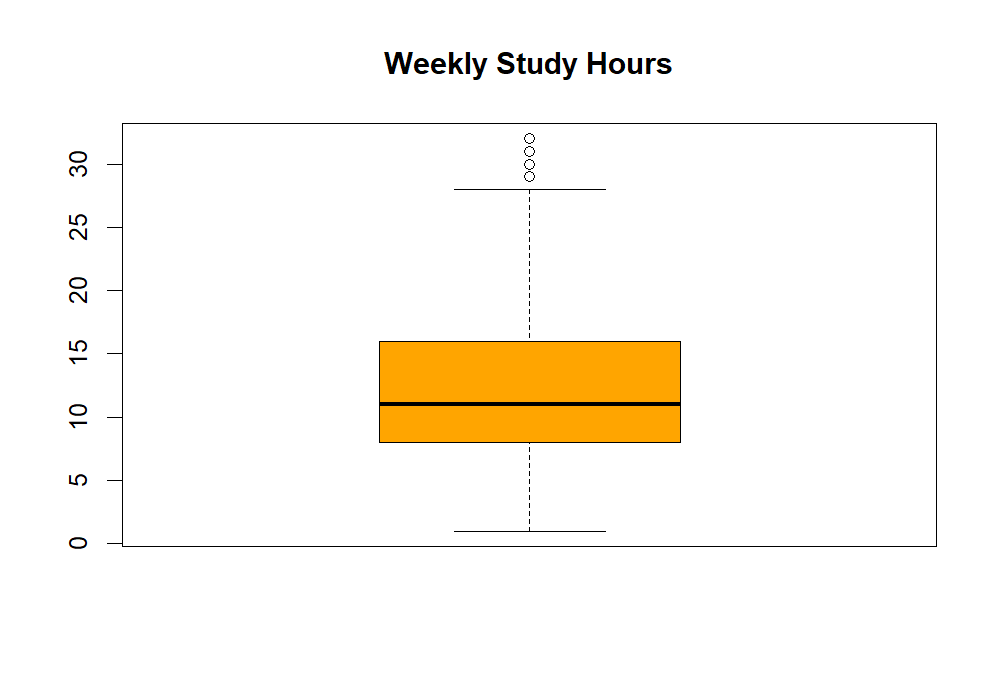

# Student Performance Analytics with R

Applying descriptive and inferential statistical techniques in R to analyze educational data, identify behavioral patterns, and generate reproducible analytical reports that support evidence-based decision making.

---

<p align="center">
  
</p>

---

# Project Overview

Educational institutions continuously collect valuable information about their students. However, raw data alone provides limited value unless it is transformed into meaningful insights through statistical analysis.

This project presents a complete analytical workflow developed in **R**, applying descriptive statistics, probability models, sampling techniques, and data visualization to explore a real educational dataset.

Rather than focusing on isolated statistical exercises, the project was designed as a **reproducible analytics solution**, following the same organizational principles commonly used in professional data analysis projects.

---

# Business Problem

Educational organizations frequently need reliable statistical evidence to better understand student characteristics, academic behavior, and satisfaction levels.

Questions such as:

- How much time do students dedicate to studying?
- How satisfied are students with their academic programs?
- How representative are random samples?
- Can statistical models support evidence-based decisions?

require more than descriptive reports—they require a structured statistical workflow.

This project demonstrates how R can be used to answer these questions through reproducible statistical analysis.

---

# Project Objectives

- Import and prepare educational data.
- Perform descriptive statistical analysis.
- Apply probability distributions.
- Evaluate sampling techniques.
- Generate automated statistical reports.
- Produce publication-quality visualizations.
- Organize the entire workflow following professional data analytics practices.

---

# Dataset

The analysis uses a dataset containing information from **250 university students**.

The dataset includes variables such as:

- Age
- Gender
- Height
- Weight
- Weekly study hours
- Weekly food expenses
- Number of approved courses
- Career satisfaction
- Smoking habits
- Employment status
- Number of siblings

---

# Analytical Workflow

<p align="center">
  
</p>

The project follows a modular workflow designed to ensure reproducibility and maintainability.

Each stage of the analysis is implemented in an independent R script, allowing the entire project to be executed sequentially while automatically generating reports and visualizations.

---

# Repository Structure

```text
student-performance-analytics-r/

│
├── data/
│     student_survey.xlsx
│
├── scripts/
│     01_data_import.R
│     02_descriptive_statistics.R
│     03_probability_models.R
│     04_sampling_analysis.R
│     05_visualizations.R
│
├── reports/
│     Generated CSV reports
│
├── images/
│     Project banner
│     Workflow
│     Generated charts
│
└── README.md
```

---

# Statistical Methods

## Descriptive Statistics

The project computes descriptive statistical measures including:

- Frequency distributions
- Measures of central tendency
- Measures of dispersion
- Quartiles

---

## Probability Models

Three probability distributions are implemented:

- Binomial Distribution
- Poisson Distribution
- Normal Distribution

These models demonstrate practical applications of inferential statistics for educational data.

---

## Sampling Analysis

A Simple Random Sampling approach is applied to evaluate how accurately sample statistics estimate population parameters.

The analysis compares:

- Population Mean
- Sample Means
- Sampling Variability

This section illustrates one of the fundamental concepts of statistical inference.

---

## Data Visualization

The project automatically generates publication-ready figures, including:

- Histogram
- Bar Chart
- Boxplot

All visualizations are exported automatically to the **images** directory.

---

# Key Findings

The statistical analysis provides several relevant insights.

- Most students dedicate between **9 and 13 hours per week** to studying.
- Career satisfaction is predominantly classified as **Very Satisfied**.
- Random sampling produces estimates that closely approximate the population mean.
- Probability distributions illustrate how uncertainty can be modeled using real educational data.

---

# Generated Reports

The analytical pipeline automatically exports statistical outputs in CSV format.

Generated reports include:

- Continuous Frequency Table
- Career Satisfaction Frequency Table
- Descriptive Statistics
- Binomial Distribution Results
- Poisson Distribution Results
- Normal Distribution Results
- Sampling Results
- Sampling Summary

Future versions of the project will also include a complete statistical report in PDF format.

---

# Visualizations

## Weekly Study Hours Distribution

<p align="center">
  
</p>

---

## Career Satisfaction

<p align="center">
  
</p>

---

## Weekly Study Hours Boxplot

<p align="center">
  
</p>

---

# Technologies

### Programming Language

- R

### Libraries

- readxl
- here

### Statistical Techniques

- Descriptive Statistics
- Inferential Statistics
- Probability Theory
- Sampling Theory
- Data Visualization

---

# Project Reproducibility

The project was organized following a modular structure to ensure reproducibility.

Executing the scripts sequentially automatically generates:

- Statistical summaries
- Frequency tables
- Probability analyses
- Sampling results
- Visualizations

No manual modification of intermediate files is required.

---

# How to Run

Clone the repository.

Open the project using **RStudio**.

Execute the scripts in the following order:

```text
01_data_import.R

02_descriptive_statistics.R

03_probability_models.R

04_sampling_analysis.R

05_visualizations.R
```

All reports and visualizations are generated automatically.

---

# Future Improvements

Potential future developments include:

- Interactive dashboards using Shiny
- Automated reports with R Markdown
- Additional statistical techniques
- Interactive visualizations
- Predictive models using machine learning

---

# About the Author

**Jorgelina Etchevest**

Economist | Data Analytics 

Current areas of interest include:

- Data Analytics
- Business Intelligence
- Statistical Analysis
- Machine Learning

For additional projects, please visit my GitHub profile.
